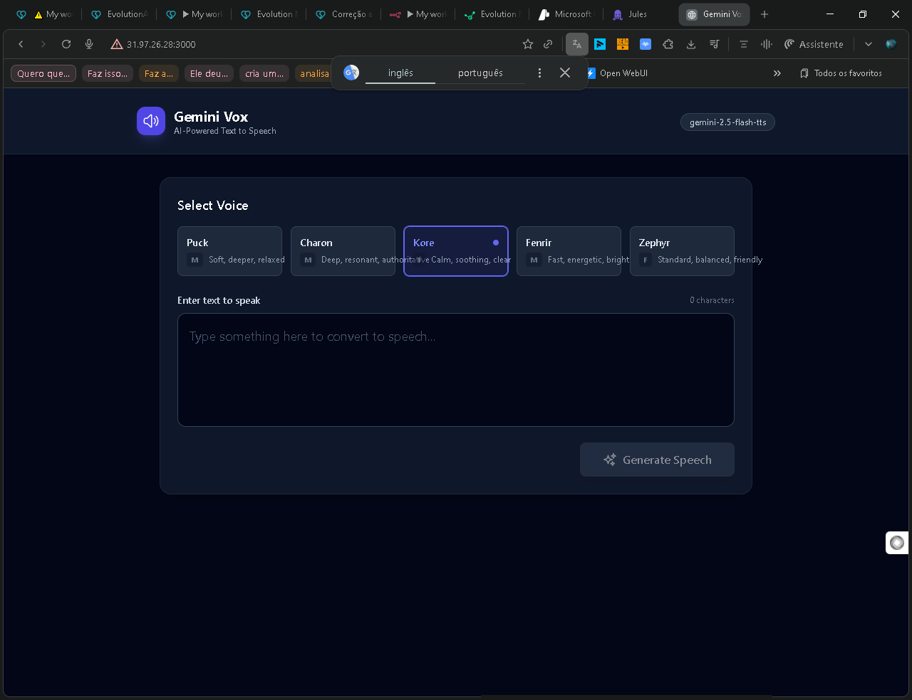

<div align="center">
  
  <h1>🎙️ AI WhatsApp Voice Automation</h1>
  <p><strong>Transforme texto em áudio profissional com IA do Google Gemini</strong></p>
  <p>
    <a href="#-funcionalidades">Funcionalidades</a> -
    <a href="#-demonstração">Demo</a> -
    <a href="#-instalação">Instalação</a> -
    <a href="#-api">API</a> -
    <a href="#-casos-de-uso">Casos de Uso</a>
  </p>
  <p>
    
    
    
    
    
  </p>
</div>

## 🚀 Sobre o Projeto

Sistema completo de Text-to-Speech (TTS) alimentado pela IA do Google Gemini 2.5, pronto para integração com WhatsApp Business, n8n workflows e Evolution API.

**Ideal para:**
✅ Atendimento automatizado 24/7 com respostas em áudio
✅ Notificações por voz para clientes e equipes
✅ Marketing conversacional personalizado
✅ Acessibilidade para pessoas com deficiência visual
✅ Cursos e treinamentos automatizados via WhatsApp

## ✨ Funcionalidades

* 🎯 Múltiplas vozes naturais em português brasileiro e outros idiomas
* ⚡ API REST completa pronta para integração em qualquer sistema
* 🔌 100% compatível com n8n workflows
* 📱 Interface web moderna para testes e gerações rápidas
* 💾 Histórico de gerações com reprodução e download
* 🎵 Áudio WAV de alta qualidade (24kHz, 16-bit, mono)
* 🔒 Seguro e escalável para ambientes de produção

## 🎬 Demonstração

### Interface Web
A aplicação possui uma interface intuitiva para gerar áudios rapidamente:



### Exemplo de Uso via API

```bash
# Gerar áudio a partir de texto
curl -X POST http://localhost:3001/api/generate \
  -H "Content-Type: application/json" \
  -d '{
    "text": "Olá! Seu pedido foi aprovado e está a caminho.",
    "voice": "Puck"
  }' \
  --output confirmacao.wav

# Reproduzir o áudio gerado
afplay confirmacao.wav  # macOS
# ou
aplay confirmacao.wav   # Linux
```

## 📦 Instalação

### Pré-requisitos
* Node.js 18 ou superior
* npm ou yarn
* Conta no Google AI Studio com API Key do Gemini

### Passo a Passo

```bash
# 1. Clone o repositório
git clone https://github.com/dotojr123/ai-whatsapp-automation.git
cd ai-whatsapp-automation

# 2. Instale as dependências
npm install

# 3. Configure as variáveis de ambiente
cp .env.example .env.local

# 4. Edite .env.local e adicione sua GEMINI_API_KEY
# GEMINI_API_KEY=sua_chave_aqui

# 5. Inicie o servidor backend
npm run server

# 6. Em outro terminal, inicie o frontend
npm run dev
```

Acesse:
* Frontend: http://localhost:5173
* API: http://localhost:3001

## 🔧 Configuração

### Obter API Key do Gemini
1. Acesse [Google AI Studio](https://aistudio.google.com/)
2. Clique em "Get API Key"
3. Crie um novo projeto (se necessário)
4. Copie a API Key gerada
5. Adicione no arquivo `.env.local`:

```bash
GEMINI_API_KEY=AIza...sua_chave_completa_aqui
```

### Variáveis de Ambiente

| Variável | Obrigatório | Descrição | Padrão |
|----------|-------------|-----------|--------|
| `GEMINI_API_KEY` | ✅ Sim | API Key do Google Gemini | - |
| `NODE_ENV` | ❌ Não | Ambiente de execução | development |
| `PORT` | ❌ Não | Porta do servidor backend | 3001 |
| `ALLOWED_ORIGINS` | ❌ Não | Origens permitidas para CORS | * |

## 🔌 API

### Endpoints Disponíveis

#### `POST /api/tts`
Gera áudio a partir de texto.

**Request:**
```json
{
  "text": "Texto para converter em áudio",
  "voice": "Puck"
}
```

**Response:**
* Content-Type: `audio/wav`
* Body: Binary WAV file

#### `POST /api/generate`
Endpoint compatível com n8n (mesmo comportamento do `/api/tts`).

**Request:**
```json
{
  "text": "Seu pedido #1234 foi enviado!",
  "voice": "Puck"
}
```

**Response:**
* Content-Type: `audio/wav`
* Body: Binary WAV file

#### `GET /health`
Verifica status do servidor.

**Response:**
```json
{
  "status": "ok",
  "endpoints": ["/api/tts", "/api/generate"],
  "apiKeyLoaded": true
}
```

### Vozes Disponíveis

| Nome da Voz | Idioma | Descrição |
|-------------|--------|-----------|
| Puck | pt-BR | Voz masculina (padrão) |
| Charon | pt-BR | Voz masculina grave |
| Kore | pt-BR | Voz feminina |
| Fenrir | pt-BR | Voz masculina energética |
| Aoede | pt-BR | Voz feminina suave |

*Consulte a documentação do Gemini para lista completa*

## 💡 Casos de Uso Reais

### 1. Atendimento WhatsApp Automatizado
> **Cliente:** "Qual status do meu pedido #1234?"
> **Bot:** 🔊 "Seu pedido 1234 foi enviado e chegará em 2 dias úteis!"

### 2. Confirmação de Agendamentos
> **Sistema:** 🔊 "Lembrete: Você tem consulta amanhã às 14h. Confirme sua presença."

### 3. Notificações de Pagamento
> **Sistema:** 🔊 "Pagamento de R$ 150,00 confirmado! Obrigado pela compra."

### 4. Curso Online via WhatsApp
> **Sistema:** 🔊 "Bem-vindo ao Módulo 2: JavaScript Avançado. Vamos começar..."

## 🏗️ Arquitetura

```text
┌──────────────┐      ┌───────────────┐      ┌──────────────┐
│   WhatsApp   │─────▶│  n8n Workflow │─────▶│  Gemini API  │
│   (Cliente)  │      │   Automation  │      │     TTS      │
└──────────────┘      └───────────────┘      └──────────────┘
                             │                       │
                             ▼                       ▼
                      ┌──────────────┐      ┌──────────────┐
                      │  Express API │─────▶│  WAV Audio   │
                      │  (Backend)   │      │   Response   │
                      └──────────────┘      └──────────────┘
```

## 🔗 Integração com n8n

Exemplo de workflow no n8n para automatizar mensagens de voz no WhatsApp:

```json
{
  "nodes": [
    {
      "name": "Webhook Trigger",
      "type": "n8n-nodes-base.webhook",
      "parameters": {
        "path": "whatsapp-incoming"
      }
    },
    {
      "name": "Generate Voice",
      "type": "n8n-nodes-base.httpRequest",
      "parameters": {
        "url": "http://localhost:3001/api/generate",
        "method": "POST",
        "jsonParameters": true,
        "bodyParametersJson": "={\n  \"text\": \"{{ $json.message }}\",\n  \"voice\": \"Puck\"\n}",
        "options": {
          "response": {
            "responseFormat": "file"
          }
        }
      }
    },
    {
      "name": "Send WhatsApp Audio",
      "type": "n8n-nodes-base.evolutionApi",
      "parameters": {
        "operation": "sendMedia",
        "mediaType": "audio"
      }
    }
  ]
}
```

## 🧪 Testes

```bash
# Testar geração de TTS via script
node test-tts.js

# Verificar health do servidor
curl http://localhost:3001/health
```

## 🛠️ Stack Tecnológico

### Frontend
* ⚛️ **React 19.2** - UI library
* 📘 **TypeScript 5.8** - Type safety
* ⚡ **Vite 6.4** - Build tool
* 🎨 **Tailwind CSS** - Styling (implícito)

### Backend
* 🟢 **Node.js + Express 5.1** - Server
* 🤖 **Google Gemini AI 1.30** - TTS engine
* 🔊 **WAV encoding** - Audio processing
* 🌐 **CORS enabled** - Cross-origin support

## 📚 Estrutura do Projeto

```text
ai-whatsapp-automation/
├── components/          # Componentes React
│   ├── Header.tsx
│   ├── VoiceSelector.tsx
│   ├── HistoryItem.tsx
│   └── LoadingSpinner.tsx
├── services/            # Serviços de integração
│   └── geminiService.ts
├── utils/               # Utilitários
│   └── audioUtils.ts
├── App.tsx              # Componente principal
├── server.js            # Backend Express
├── index.tsx            # Entry point React
├── index.html           # HTML template
├── package.json         # Dependencies
├── vite.config.ts       # Vite config
├── tsconfig.json        # TypeScript config
├── .env.example         # Exemplo de variáveis
└── README.md            # Este arquivo
```

## 🚀 Deploy

### Vercel (Recomendado para frontend)
```bash
# Instalar Vercel CLI
npm i -g vercel

# Deploy
vercel --prod
```

### Railway/Render (Recomendado para backend)
1. Conecte seu repositório GitHub
2. Configure a variável `GEMINI_API_KEY`
3. Deploy automático em cada push

## 📄 Licença

Este projeto está licenciado sob a MIT License - veja o arquivo [LICENSE](LICENSE) para detalhes.

## 🤝 Suporte Comercial

**Desenvolvido por:** Art na Web
**Email:** artnaweb2022@gmail.com
**LinkedIn:** [Conecte-se comigo](#)

**Precisa de uma solução customizada?**
* ✅ Integração com seus sistemas internos
* ✅ Customização de vozes e idiomas
* ✅ Treinamento de equipe técnica
* ✅ Suporte dedicado e SLA
* ✅ Features exclusivas sob demanda

**Entre em contato para orçamento personalizado!**

---

## ⭐ Contribuindo

Contribuições são bem-vindas! Sinta-se à vontade para:
1. Fazer um fork do projeto
2. Criar uma branch para sua feature (`git checkout -b feature/MinhaFeature`)
3. Commit suas mudanças (`git commit -m 'Adiciona MinhaFeature'`)
4. Push para a branch (`git push origin feature/MinhaFeature`)
5. Abrir um Pull Request

## 📊 Roadmap

- [ ] Suporte a SSML (Speech Synthesis Markup Language)
- [ ] Cache de áudios gerados (Redis)
- [ ] Dashboard de analytics e métricas
- [ ] Suporte a múltiplos idiomas simultâneos
- [ ] Webhooks para notificações de conclusão
- [ ] Rate limiting configurável
- [ ] Docker Compose para deploy simplificado
- [ ] Testes automatizados (Jest + Cypress)

## 🙏 Agradecimentos

* **Google Gemini AI** - Pela poderosa API de TTS
* **Evolution API** - Integração WhatsApp
* **n8n** - Plataforma de automação
* Comunidade open source

<div align="center">
  <p>⭐ Se este projeto foi útil, deixe uma estrela no GitHub!</p>
  <p>Feito com ❤️ e ☕ no Brasil</p>
</div>
